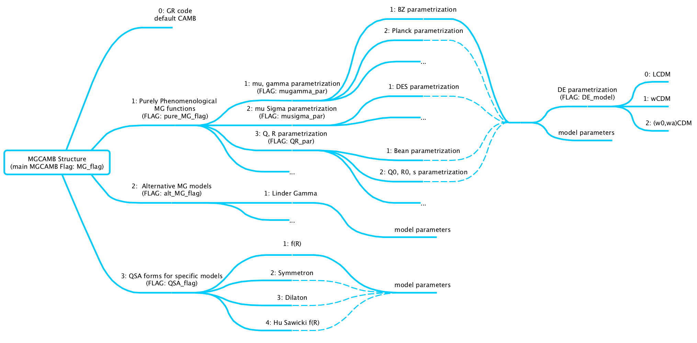

MGCAMB v4.0
===========
## Modified Growth with CAMB
This is the official repository for the MGCAMB v4.0 patch.  Below there are an introduction to the code and the instructions to install and run the code. This new version of the code is introduced in the new paper to be published soon.  


## Table of contents
* [1. Introduction](#1-introduction)
   * [Structure of the code](#structure-of-the-code)
   * [Citing MGCAMB](#citing-mgcamb)
* [2. How to install](#2-how-to-install)
* [3. How to run](#3-how-to-run)
* [4. What's new](#4-whats-new)
* [5. Authors List](#authors-list)


## 1. Introduction
Modified Growth with CAMB (MGCAMB) is a patch for the Einstein Boltzmann solver [CAMB](https://github.com/cmbant/CAMB) that intrdouces phenomenological Modifications of Growth (MG) along with dynamical Dark Energy (DE). It includes several phenomenological parametrizations. For instance:

- the mu, gamma parametrization, defined as
<p align="center">

</p>

- the mu, Sigma parametrization, defined as
<p align="center">

</p>

- the Q,R parametrization, defined as
<p align="center">

</p>

MGCAMB is implemented in the latest version of [CosmoMC](https://github.com/cmbant/CosmoMC). The MGCosmoMC code can be found on this [repository](https://github.com/sfu-cosmo/MGCosmoMC)

### Structure of the code
The new MGCAMB patch is structured as in the figure.

<p align="center">

</p>

The parameters in  [``` params_MG.ini ``` ](inifiles/params_MG.ini) are used to run the code and follow the structure above. 
Please, note that dynamical DE is supported in the ``` pure_MG_models ``` and ``` reconstruction model ```, where DE perturbations are also included. 


### Citing MGCAMB
If you use MGCAMB for your scientific work, please cite the following papers:

* *MGCAMB with massive neutrinos and dynamical dark energy*   
    Alex Zucca, Levon Pogosian, Alessandra Silvestri, and Gong-Bo Zhao  
    [arXiv:1901.05956 [astro-ph.CO]](https://arxiv.org/abs/1901.05956)
    
    
* *Testing Gravity with CAMB and CosmoMC*  
    Alireza Hojjati, Levon Pogosian, Gong-Bo Zhao,  
    [arXiv:1106.4543 [astro-ph.CO]](https://arxiv.org/abs/1106.4543), [JCAP 1108:005,2011](http://iopscience.iop.org/article/10.1088/1475-7516/2011/08/005)
    
    
* *Searching for modified growth patterns with tomographic surveys*  
    Gong-Bo Zhao, Levon Pogosian, Alessandra Silvestri, Joel Zylberberg,  
    [arXiv:0809.3791 [astro-ph]](http://arxiv.org/abs/0809.3791), [Phys. Rev. D 79, 083513](https://journals.aps.org/prd/abstract/10.1103/PhysRevD.79.083513)


as well as the original CAMB [paper](http://arxiv.org/abs/astro-ph/9911177). 

## 2. How to install
To install MGCAMB on your machine, simply run
```bash
git clone https://github.com/sfu-cosmo/MGCAMB.git
cd MGCAMB/fortran/
make 
```

## 3. How to run
To run MGCAMB, first modify the  [``` params_MG.ini ``` ](inifiles/params_MG.ini) file according to which models you want to analyze. Then run

```bash
./camb ../inifiles/params.ini
```


## 4. What's new
New features with this new version of the code:
- implemented the QSA models where only dark matter is coupled to scalar field
- implemented the generic mu, sigma parametrization for different models
- extend the dynamical dark energy by including DE perturbations to be consistent with CAMB in GR limit
- provide angular power spectrum of variables for MG models from python interface
  (make sure to use function ``` set_mgparams ``` alongside other functions e.g. ``` set_cosmology ``` or ``` set_params ``` in your script.)
- the code has been restructured and updated to the CAMB 1.3.5 version

The MG and DE parametrizations along with the computation of the quantities related to the perturbations are introduced in the file [``` mgcamb.f90 ```](fortran/mgcamb.f90).


## 5. Authors List
Main Developer:
- Zhuangfei Wang (Email: zhuangfei_wang@sfu.ca)
- Alex Zucca (Email: azucca@dwavesys.com)

Original Code Developers:
* [Gong-Bo Zhao](http://english.nao.cas.cn/aboutus/directors/202103/t20210321_265637.html)
* Alireza Hojjati
* [Levon Pogosian](http://www.sfu.ca/%7Elevon/)
* [Alessandra Silvestri](http://wwwhome.lorentz.leidenuniv.nl/%7Esilvestri/Home.html)


Repo created and maintained by Zhuangfei Wang. If you find any bugs in the code, please contact Zhuangfei Wang at zhuangfei_wang@sfu.ca .

<p align="center">
    <a href="http://www.sfu.ca/physics.html"></a>
    <a href="http://www.sfu.ca/physics/cosmology/"></a>
</p>
