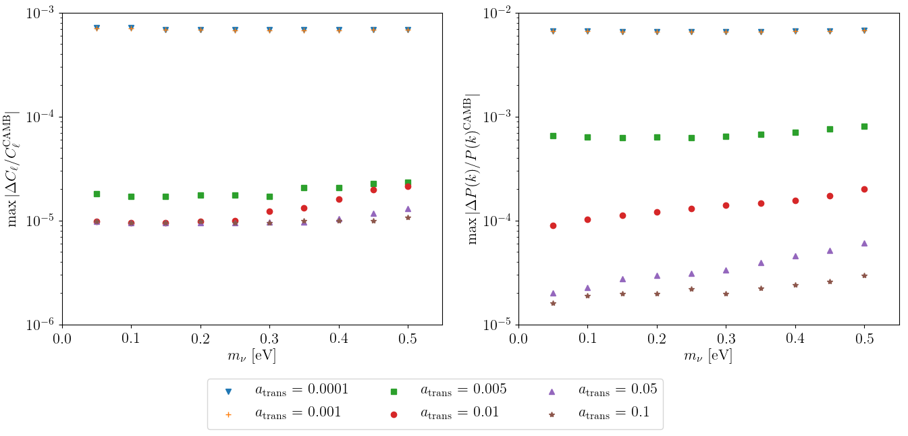

<p align="center">

</p>

# MGCAMB v3.0
## Modified Growth with CAMB
This is the official repository for the MGCAMB v3.0 patch.  Below there are an introduction to the code and the instructions to install  and run the code. This new version of the code was introduced in the paper MGCAMB with massive neutrinos and dynamical Dark Energy (DE)


## Table of contents
* [Introduction](#introduction)
   * [Structure of the code](#structure-of-the-code)
   * [Consistency of the code](#consistency-of-the-code)
   * [Referencing MGCAMB](#referencing-mgcamb)
* [How to install](#how-to-install)
* [How to run](#how-to-run)
   * [Run the code](#run-the-code)
   * [Run the test suite](#run-the-test-suite)
* [What's new](#whats-new)
* [Examples](#examples)
*  [Authors List](#authors-list)


## Introduction
Modified Growth with CAMB (MGCAMB) is a patch for the Einstein Boltzmann solver CAMB that intrdouces phenomenological modifications of growth along with dynamical Dark Energy. It includes several phenomenological parametrization


### Structure of the code
The new MGCAMB patch is structured as in the figure.

<p align="center">

</p>


### Consistency of the code
The General Relativity (GR) limit of the code has been tested. The results are shown in the figure below.

<p align="center">

</p>

When the switch to MG is set at early times, the matter power spectrum systematic error increase at values slightly below 1%. Below there is an example of the relative differences 


### Referencing MGCAMB
If you use MGCAMB for your scientific work, please cite the following papers.

## How to install
To install MGCAMB in your machine simply run
```bash
git clone https://github.com/sfu-cosmo/MGCAMB.git
cd MGCAMB
make camb
```

## How to run

### Run the code
To run MGCAMB, first modify the  ``` params_MG.ini ``` file. Then run

```bash
./camb params_MG.ini
```


### Run the test suite
If you want to run the test suite to produce the consistency plots in our paper, then run

```bash
cd mgcamb_tests
make 
```


## What's new
With these new version of the code we implemented consistently massive neutrinos. 

Also, the code has been checked and restructured and updated to the CAMB 2018 version. 

The MG and DE parametrizations along with the computation of the quantities related to the perturbations are introduced in the file [``` mgcamb.f90 ```](mgcamb.f90).

## Examples

## Authors List
Main Developer:
- Alex Zucca azucca@sfu.ca

Original Code Developers:
- Gong-Bo Zhao
- Alireza Hojjati
- Alessandra Silvestri
- Levon Pogosian


Repo created and maintained by Alex Zucca
